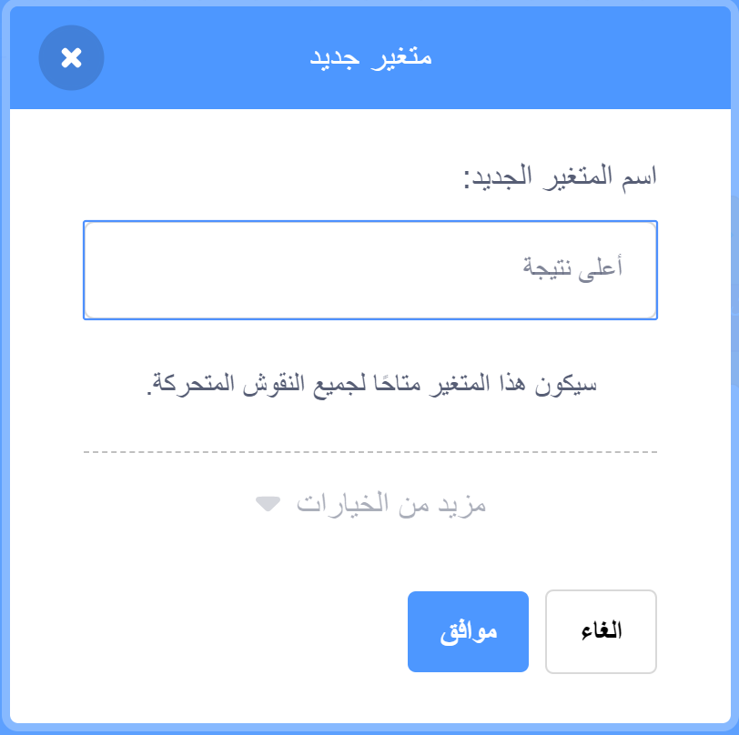

لا شك أنه من الممتع تتبع أعلى نتيجة في اللعبة.

لنفترض أن لديك متغيرًا يُسمى `نتيجة`{:class="blockdata"}، معينًا إلى القيمة صفر في بداية كل لعبة.

قم بإضافة متغير أخر يُسمى `أعلى نتيجة`{:class="blockdata"}.

في نهاية اللعبة (أو عندما تريد تحديث أعلى نتيجة)، ستحتاج إلى التحقق مما إذا كان لديك `نتيجة عالية` جديدة ام لا.

