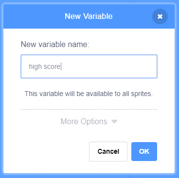
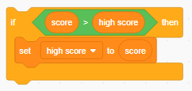

গেমে উচ্চ স্কোরের ট্র্যাক রাখা বেশ মজাদার।.

ধরা যাক আপনার `score`{:class="blockdata"} নামে একটি ভ্যারিয়েবল রয়েছে, যা প্রতিটি গেমের শুরুতে শূন্যতে সেট হয়ে যায়।.

এই নামে আর একটি ভ্যারিয়েবল যুক্ত করুন `high score`{:class="blockdata"}.

গেমের শেষে (বা যখনই আপনি উচ্চ স্কোরটি আপডেট করতে চান) আপনার নতুন `high score`. আছে কিনা তা পরীক্ষা করে দেখতে হবে।.

