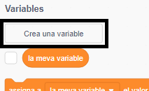
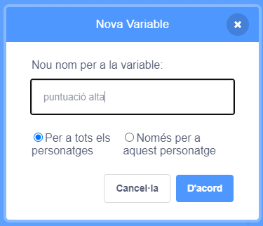
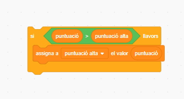

És divertit fer un seguiment d'una puntuació alta en un joc.

Suposem que tens una variable anomenada `puntuació`{:class="blockdata"}, que es posa a zero al principi de cada joc.

Afegeix una altra variable anomenada `puntuació alta`{:class="blockdata"}.

Al final del joc (o sempre que vulguis actualitzar la puntuació alta), hauràs de comprovar si tens una nova `puntuació alta`.

