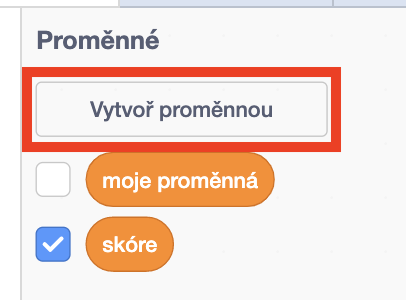
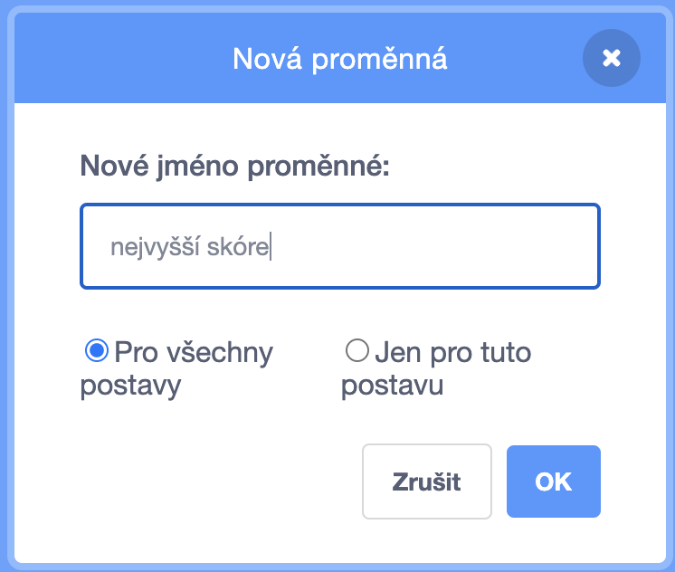
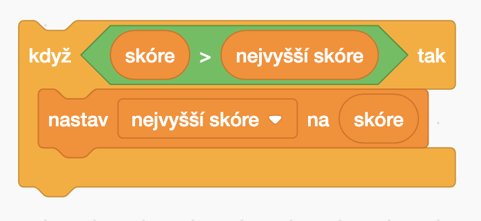

Sledování nejvyššího skóre ve hře je prostě zábava.

Předpokládejme, že máš proměnnou nazvanou `skóre`{:class="blockdata"}, která je naastavena nulu na začátku každé hry.

Přidejte další proměnnou nazvanou `nejvyšší skóre`{:class="blockdata"}.

Na konci hry (nebo kdykoli chceš aktualizovat nejvyšší skóre) musíš zkontrolovat, zda máš nové `nejvyšší skóre`.

