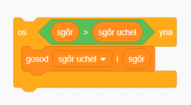

Mae'n hwyl cadw sgôr uchel mewn gêm.

Dyweder fod gen ti newidyn o'r enw `sgôr`{:class="blockdata"}, sydd yn mynd i ddim ar ddechrau pob gêm.

Ychwanega newidyn arall o'r enw `sgôr uchel`{:class="blockdata"}.

Ar ddiwedd y gêm (neu pryd bynnag rwyt ti am ddiweddaru'r sgôr uchel), bydd angen i ti wirio a oes gen ti`sgôr uchel` newydd.

