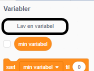
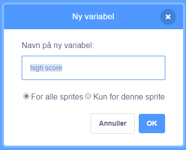
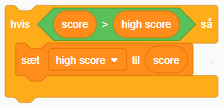

Det er sjovt at holde øje med en high score i et spil.

Lad os sige, at du har en variabel kaldet ` score ` {: class = "blockdata"}, som bliver sat til nul i begyndelsen af hvert spil.

Tilføj en anden variabel kaldet ` high score ` {: Class = "blockdata"}.

I slutningen af ​​spillet (eller når du vil opdatere high score), skal du kontrollere, om du har en ny `high score`.

