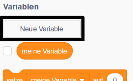

Es macht Spaß, den Highscore in einem Spiel im Auge zu behalten.

Nehmen wir an, du hast eine Variable namens `Spielstand`{:class="blockdata"}, die bei jedem Spielstart auf Null gesetzt wird.

Füge eine weitere Variable hinzu und nenne sie `Highscore`{:class="blockdata"}.

Am Ende des Spiels (oder wenn du den Highscore aktualisieren möchtest) musst du überprüfen, ob du einen neuen `Highscore` hast.

