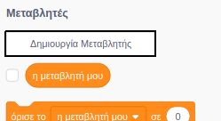
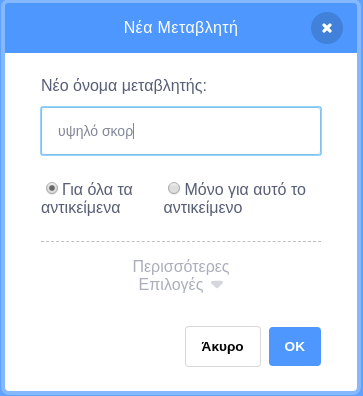
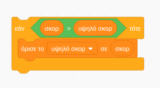

Είναι διασκεδαστικό να παρακολουθείς το υψηλότερο σκορ σε ένα παιχνίδι.

Ας υποθέσουμε ότι έχεις μία μεταβλητή που ονομάζεται `σκορ`{:class="blockdata"}, η οποία έχει την τιμή μηδέν στην αρχή κάθε παιχνιδιού.

Πρόσθεσε άλλη μία μεταβλητή που ονομάζεται `υψηλό σκορ`{:class="blockdata"}.

Στο τέλος του παιχνιδιού (ή όποτε θέλεις να ενημερώνεις το υψηλότερο σκορ), θα πρέπει να ελέγχεις αν έχεις ένα νέο `υψηλό σκορ`.

