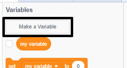
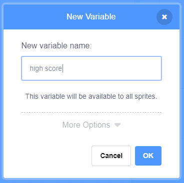
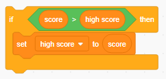

It's fun to keep track of a high score in a game. 

Let's say you have a variable called `score`, which gets set to zero at the beginning of each game. 

Add another variable called `high score`. 

At the end of the game (or whenever you want to update the high score), you'll need to check whether you have a new `high score`. 

