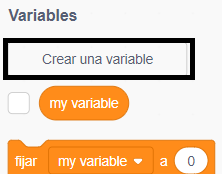
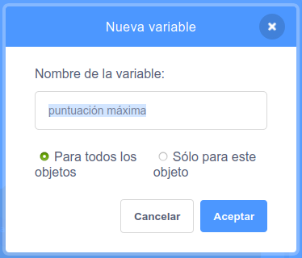
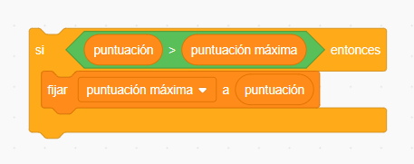

Es divertido hacer el seguimiento de la puntuación máxima en un juego.

Supongamos que tienes una variable llamada `puntuación`{:class="blockdata"}, que se fija a cero al inicio de cada juego.

Añade otra variable llamada `puntuación máxima` {: class = "blockdata"}.

Al final del juego (o cuando quieras actualizar la puntuación máxima) tendrás que comprobar si tienes una nueva `puntuación máxima`.

