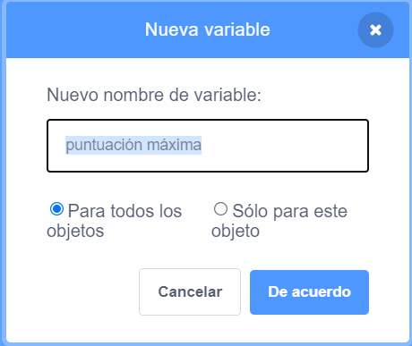

It's fun to keep track of a high score in a game.

Supongamos que tienes una variable llamada `puntos`{:class="blockdata"}, que al inicio de cada juego se establece a cero.

Add another variable called `high score`{:class="blockdata"}.

At the end of the game (or whenever you want to update the high score), you'll need to check whether you have a new `high score`.

