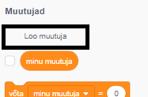
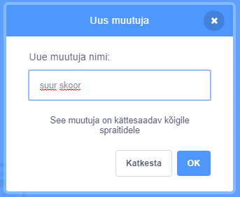
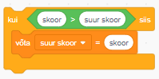

Mängu kõrge skoori jälgimine on lõbus.

Oletame, et sul on muutuja nimega `skoor`{:class="blockdata"}, millele antakse iga mängu alguses väärtuseks null.

Lisa teine ​​muutuja nimega `kõrge skoor`{:class="blockdata"}.

Iga mängu lõpus (või millal iganes sa soovid suurt skoori värskendada), pead kontrollima, kas sul on uus `suur skoor`.

