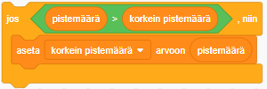

On hauskaa seurata korkeinta pistemäärää pelissä.

Oletetaan, että sinulla on muuttuja nimeltä `pistemäärä`{:class="blockdata"}, joka asetetaan nollaan kunkin pelin alussa.

Lisää toinen muuttuja nimeltä `korkein pistemäärä`{:class="blockdata"}.

Pelin lopussa (tai kun haluat päivittää korkeimman pistemäärän), sinun on tarkistettava, onko sinulla uusi `korkein pistemäärä`.

