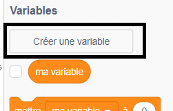
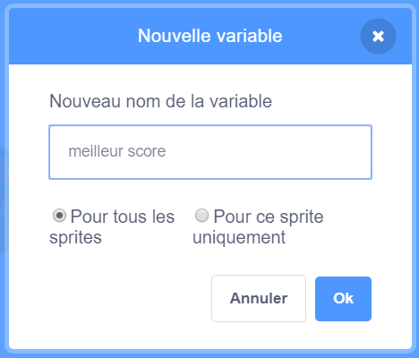
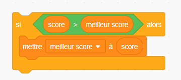

C'est amusant de garder une trace du meilleur score dans un jeu.

Disons que tu as une variable appelée `score`{:class="blockdata"}, qui est mise à zéro au début de chaque partie.

Ajoute une autre variable appelée `meilleur score`{:class="blockdata"}.

A la fin du jeu (ou chaque fois que tu veux mettre à jour le meilleur score), tu devras vérifier si tu as un nouveau `meilleur score`.

