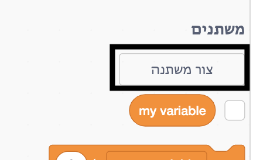
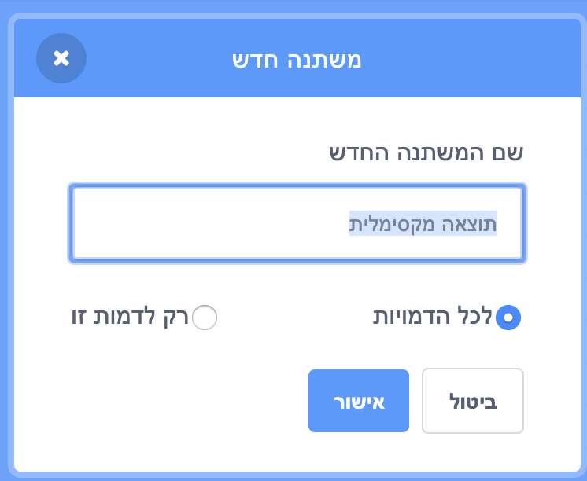
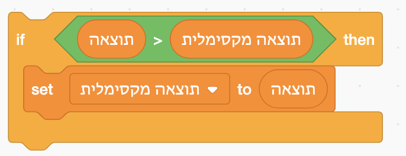

כייף לעקוב אחר התוצאה המקסימלית במשחק.

נניח שיש לך משתנה הנקרא `תוצאה`, שמוגדר לאפס בתחילת כל משחק.

הוסף משתנה נוסף הנקרא `תוצאה מקסימלית`.

בסיום המשחק (או בכל פעם שתרצה לעדכן את התוצאה המקסימלית), עליך לבדוק אם יש לך תוצאה חדשה גבוהה יותר ``.

