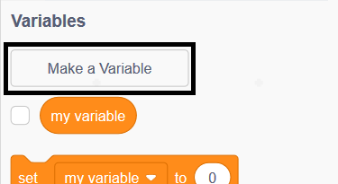
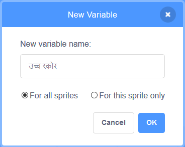
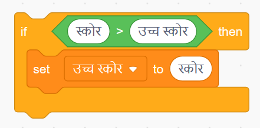

खेल में हाई स्कोर का ध्यान रखना मज़ेदार होता है।

मान लें आपके पास `score`{:class="blockdata"} नाम का वेरिएबल है, जो हर खेल के शुरुआत में ज़ीरो पर सेट हो जाता है।

`high score`{:class="blockdata"} नाम का एक और वेरिएबल जोड़ें।

खेल के अंत में (या जब भी आप हाई स्कोर को अपडेट करना चाहें), आपको यह देखना होगा कि आपने अपना नया `high score` बनाया की नहीं।

