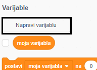
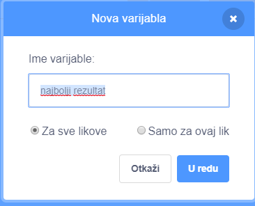
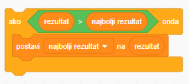

Zabavno je pratiti najbolji rezultat u igri.

Pretpostavimo da imaš varijablu nazvanu `rezultat`{:class="blockdata"} koja se na početku svake igre postavlja na nulu.

Dodaj još jednu varijablu i nazovi je `najbolji rezultat`{:class="blockdata"}.

Na kraju igre (ili kad god želiš promijeniti najbolji rezultat) trebaš provjeriti imaš li novi `najbolji rezultat`.

