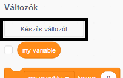
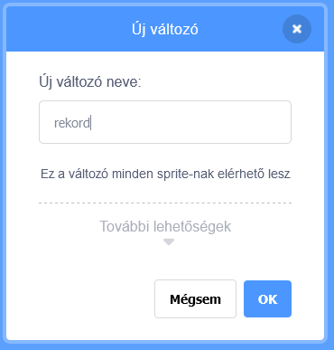
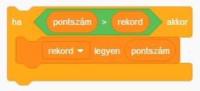

Egy játékban szórakoztató kihívás megdönteni a rekordot.

Let's say you have a variable called `score`{:class="blockdata"}, which gets set to zero at the beginning of each game.

Add another variable called `high score`{:class="blockdata"}.

A játék végén (vagy bármikor, amikor frissíteni szeretnéd a rekordot), ellenőrizned kell, hogy a pontszám nagyobb-e, mint a `rekord`.

