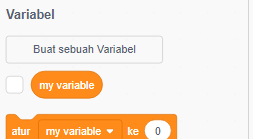
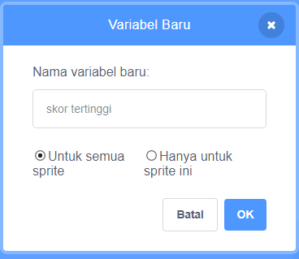
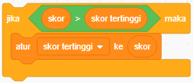

Sangat menyenangkan untuk melacak skor tertinggi dalam permainan.

Anggap saja kamu punya sebuah variabel bernama `skor`{:class="blockdata"}, yang akan dimulai dari nol di awal permainan.

Tambahkan variabel lain dengan nama `skor tertinggi`{:class="blockdata"}.

Di akhir permainan (atau kapan pun kamu ingin memperbarui skor tertinggi), kamu perlu memeriksa apakah kamu memiliki `skor tertinggi `.

