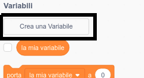
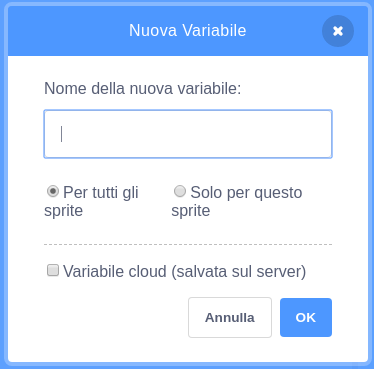
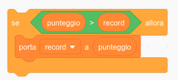

Riuscire a tenere traccia di un punteggio elevato in una partita è molto divertente.

Let's say you have a variable called `score`{:class="blockdata"}, which gets set to zero at the beginning of each game.

Add another variable called `high score`{:class="blockdata"}.

Alla fine del gioco (o quando vuoi aggiornare il punteggio più alto), dovrai verificare se hai un raggiunto un nuovo `punteggio elevato`.

