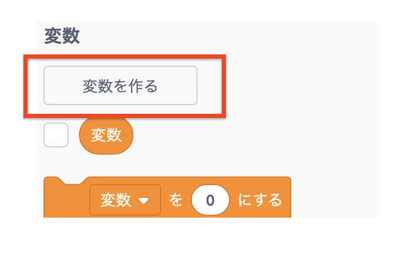
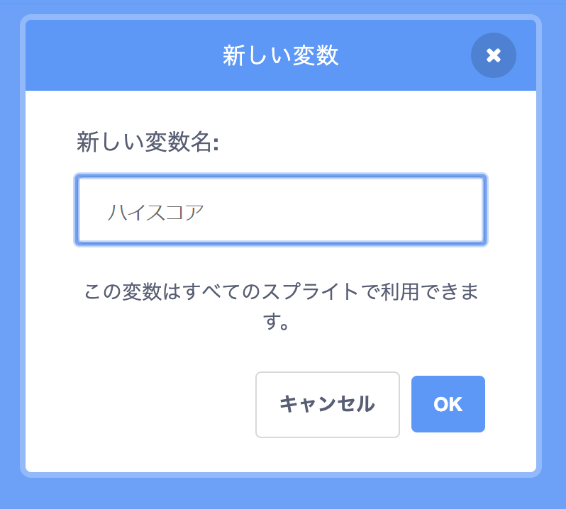
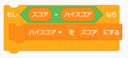

ゲームで高得点を記録するのは楽しいことです。

Let's say you have a variable called `score`{:class="blockdata"}, which gets set to zero at the beginning of each game.

Add another variable called `high score`{:class="blockdata"}.

ゲーム終了時（または高点数を更新したい場合）、新しい `高点数` があるかどうかを確認する必要があります。

