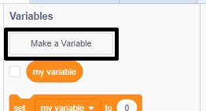

ಆಟದಲ್ಲಿ ಹೆಚ್ಚಿನ ಅಂಕವನ್ನು ಗಮನದಲ್ಲಿರಿಸಿಕೊಳ್ಳುವುದು ತಮಾಷೆಯಾಗಿರುತ್ತದೆ.

ನೀವು `score`{:class="blockdata"} ಎಂಬ ಅಸ್ಥಿರವನ್ನು ಹೊಂದಿದ್ದೀರಿ ಎಂದು ಹೇಳೋಣ, ಅದು ಪ್ರತಿ ಆಟದ ಪ್ರಾರಂಭದಲ್ಲಿ ಶೂನ್ಯಕ್ಕೆ ಹೊಂದಿಸಲ್ಪಡುತ್ತದೆ.

`high score`{:class="blockdata"} ಎಂಬ ಇನ್ನೊಂದು ಅಸ್ಥಿರವನ್ನು ಸೇರಿಸಿ.

ಆಟದ ಕೊನೆಯಲ್ಲಿ (ಅಥವಾ ನೀವು ಹೆಚ್ಚಿನ ಅಂಕವನ್ನು ನವೀಕರಿಸಲು ಬಯಸಿದಾಗ), ನೀವು ಹೊಸ `high score` ಅನ್ನು ಹೊಂದಿದ್ದೀರಾ ಎಂದು ಪರಿಶೀಲಿಸಬೇಕು.

