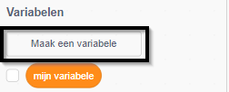
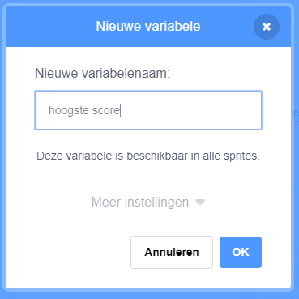
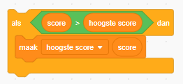

Het is leuk om een ​​hoogste score in een spel bij te houden.

Stel dat je een variabele `score`{:class="blockdata"} hebt, die aan het begin van elk spel op nul wordt gezet.

Voeg nog een variabele toe met de naam `hoogste score`{:class="blockdata"}.

Aan het einde van het spel (of wanneer je de hoogste score wilt bijwerken), moet je controleren of je een nieuwe `hoogste score` hebt.

