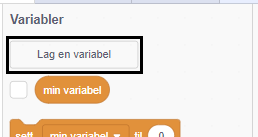
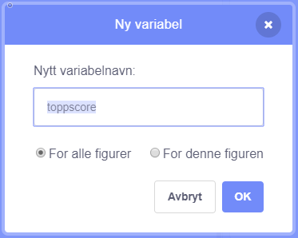
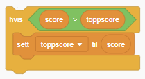

Det er morsomt å holde styr på toppscoren i et spill.

La oss si at du har en variabel som heter `score`{:class="blockdata"}, som blir satt til null i begynnelsen av hvert spill.

Legg til en annen variabel kalt `toppscore`{:class="blockdata"}.

På slutten av spillet (eller når du vil oppdatere toppscoren), må du sjekke om du har en ny `toppscore`.

