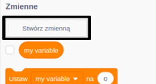

Fajnie jest śledzić najlepszy wynik w grze.

Załóżmy, że masz zmienną o nazwie `wynik`{:class="blockdata"}, która zostaje ustawiona na zero na początku każdej gry.

Dodaj kolejną zmienną o nazwie `najlepszy wynik`{:class="blockdata"}.

Pod koniec gry (lub gdy chcesz zaktualizować najlepszy wynik), musisz sprawdzić, czy masz nowy `najlepszy wynik`.

