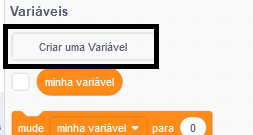
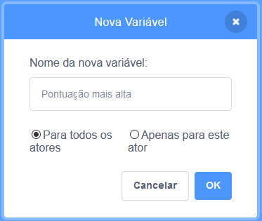
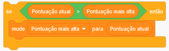

É divertido acompanhar a pontuação mais alta em um jogo.

Digamos que você tenha uma variável chamada `Pontuação atual`{:class="blockdata"}, que é definida como zero no início de cada jogo.

Crie uma nova variável chamada `Pontuação mais alta`{:class="blockdata"}.

No final do jogo (ou sempre que quiser atualizar a pontuação mais alta), você precisará verificar se a `Pontuação mais alta` foi ultrapassada.

