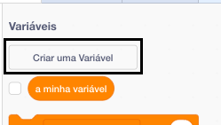
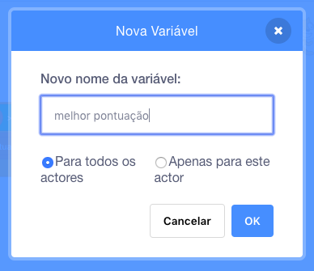
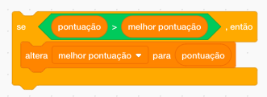

É divertido manter o registo da melhor pontuação num jogo.

Digamos que tens uma variável chamada `pontuação`, que é definida como zero no início de cada jogo.

Adiciona outra variável chamada `melhor pontuação`.

No fim do jogo (ou sempre que quiseres atualizar a melhor pontuação), tens de verificar se fizeste uma nova `melhor pontuação`.

