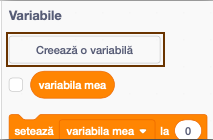

Este distractiv să ții evidența celui mai mare scor într-un joc.

Să spunem că ai o variabilă numită `scor`{:class="blockdata"}, care devine zero la începerea fiecărui joc.

Adaugă o altă variabilă, numită `top scor`{:class="blockdata"}.

La sfârșitul jocului (sau oricând dorești să actualizezi recordul), va trebui să verifici dacă ai un nou `top scor`.

