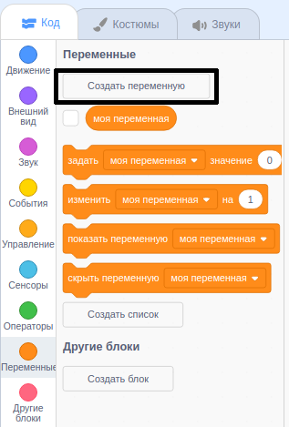
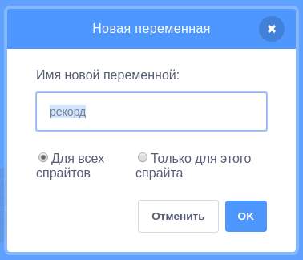
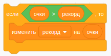

Приятно знать лучший результат в игре, т. е. максимум баллов, которого удалось достичь игрокам.

Let's say you have a variable called `score`{:class="blockdata"}, which gets set to zero at the beginning of each game.

Add another variable called `high score`{:class="blockdata"}.

В конце игры (или всякий раз, когда ты хочешь обновить сведения о лучшем результате), тебе нужно проверить, есть ли у тебя новый `лучший результат`.

