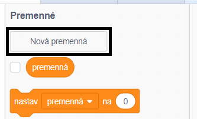
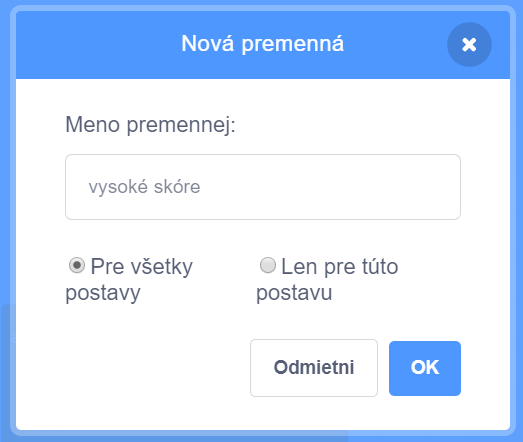
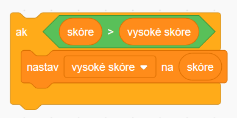

Je zábavné sledovať v hre svoje vysoké skóre.

Povedzme, že máš premennú nazvanú `skóre`{:class="blockdata"}, ktorá je na začiatku každej hry nastavená na nulu.

Pridaj inú premennú s názvom `vysoké skóre`{:class="blockdata"}.

Na konci hry (alebo kedykoľvek, keď chceš aktualizovať vysoké skóre), budeš musieť skontrolovať, či máš nové `vysoké skóre`.

