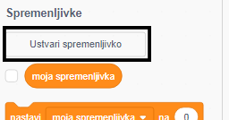
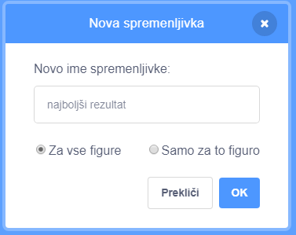
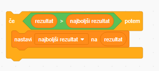

It's fun to keep track of a high score in a game.

Recimo, da imaš spremenljivko z imenom `score`{: class = "blockdata"}, ki se na začetku vsake igre nastavi na nič.

Dodaj še eno spremenljivko z imenom » `:`{: class = "blockdata"}.

Na koncu igre (ali kadarkoli želiš posodobiti najboljši rezultat), boš moral preveriti, ali obstaja nov `najboljši rezultat`.

