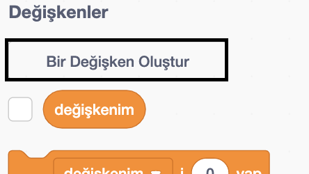
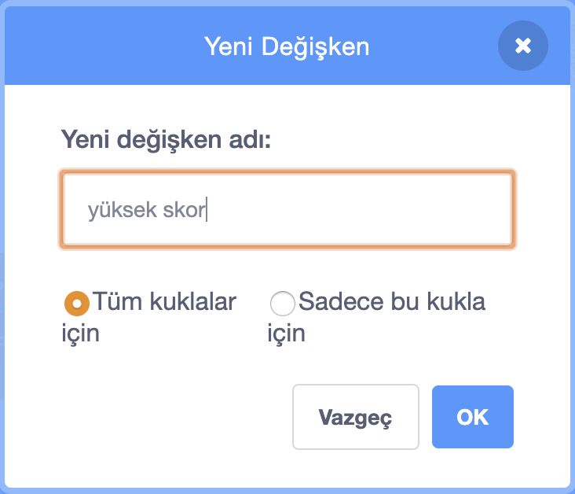
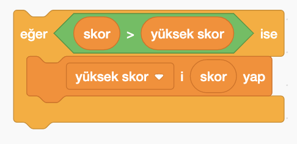

Bir oyunda yüksek skoru takip etmek eğlencelidir.

Her oyunun başında sıfıra ayarlanan `skor` isimli bir değişkeniniz olduğunu varsayalım.

`yüksek skor` adlı başka bir değişken ekleyin{:class="blockdata"}.

Oyunun sonunda (veya yüksek skoru güncellemek istediğinizde), yeni bir `yüksek skor` olup olmadığını kontrol etmeniz gerekir.

