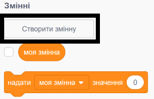
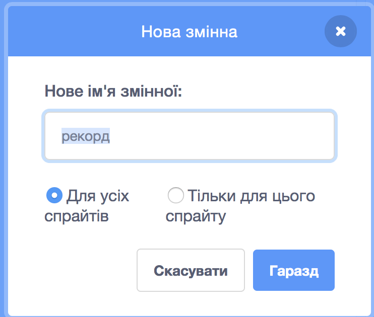
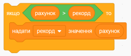

Забавно відстежувати рекордний рахунок у грі.

Скажімо, в тебе є змінна з назвою `рахунок`{: class="blockdata"}, якiй надається нульове значення на початку кожної гри.

Додай ще одну змінну з назвою `рекорд`{:class="blockdata"}.

Наприкінці гри (або кожного разу, коли ти хочеш оновити рекорд), тобі потрібно буде перевіряти, чи встановлено новий `рекорд`.

